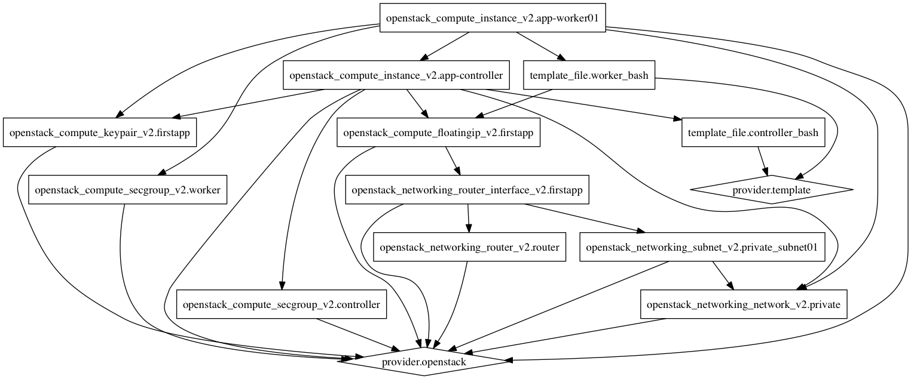

# OpenStack FirstApp with Terraform

This Terraform project offerst a way to deploy the OpenStack FirstApp,
this app is explained into [OpenStack firstapp guide](http://developer.openstack.org/firstapp-libcloud/getting_started.html).
*Note: This project was created for didactic purposes.*

## Requirements:

This project requires the the [Terraform client](https://www.terraform.io/intro/getting-started/install.html) and
OpenStack credentials like [TryStack access](http://trystack.org/)

### Steps for execution:

    $ git clone https://github.com/electrocucaracha/terraform-firstapp.git
    $ cd terraform-firstapp
    $ terraform apply /
        -var 'user_name=TRYSTACK_USERNAME' /
        -var 'tenant_name=TRYSTACK_PROJECT_NAME' /
        -var 'password=TRYSTACK_PASSWORD'
    $ bash ssh-controller.

### Destroy:

    terraform destroy

### Execution Graph:

